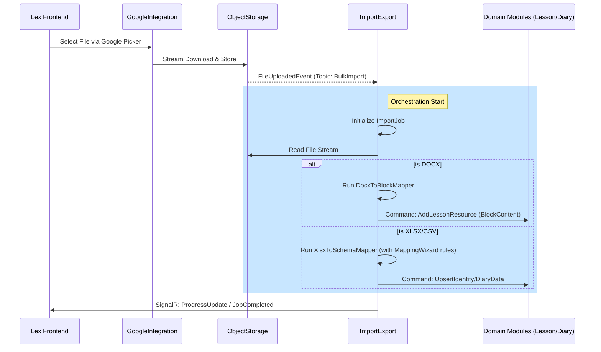

# Specification: Import/Export Orchestration Flow

## 1. Overview
- **Category**: Cross-Module Orchestration
- **Parent Module**: ImportExport
- **Purpose**: Define the choreography of services involved in moving data from external sources into the Lex domain schemas.

## 2. Interaction Diagram (Conceptual)

## 3. Detailed Step Descriptions

### Step 1: Format Parsing (The Extraction Layer)
- The `ImportExport` module uses specific parsers for each MIME type.
- **DOCX**: Maps Word paragraphs to `Heading` and `Paragraph` blocks. Maps images embedded in Word to sub-resources in `ObjectStorage`.
- **XLSX**: Maps rows to DTOs for bulk validation against the target database schema.

### Step 2: Mapping & Validation (The Transformation Layer)
- If the column names in a spreadsheet don't match Lex's internal schema exactly, the `MappingWizard` (Frontend) provides a JSON map.
- The backend uses this map to normalize data before persistence.

### Step 3: Persistence (The Load Layer)
- Instead of direct DB access, `ImportExport` sends **Bulk Commands** to the target module's internal services.
- This ensures that all domain invariants (e.g., uniqueness, foreign keys) are enforced by the module that owns the data.

## 4. Resilience & Error Handling
- **Transaction Management**: Each block of 100 rows is processed as a sub-transaction to prevent full rollback on a single error.
- **Error Capture**: Row-level validation errors are collected and returned in the final `ValidationPackage`.

## 5. Security
- Only the `ImportExport` service account has permission to read files specifically tagged for bulk ingestion in `ObjectStorage`.
